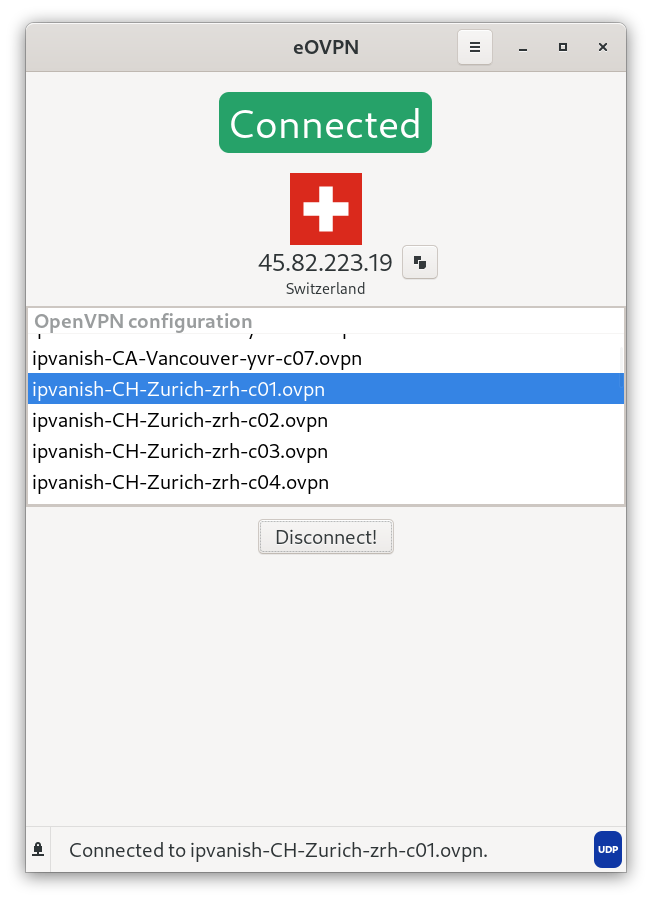

# eOVPN

<div align="center">




</div>
---

`eOVPN` is a application to connect, manage and update(from remote <i>.zip</i>) OpenVPN configurations.


## Setup

1. Open `Settings` from the menu.
2. Fill in the required details:
    * **Configuration Source**: This refers to a link that contains a zip file with OpenVPN configurations. Example: [IPVanish](https://www.ipvanish.com/software/configs/configs.zip), [NordVPN](https://downloads.nordcdn.com/configs/archives/servers/ovpn.zip)

        * [`eOVPN` also supports local directory/folder/zip]

    * **Update On Start(*Checkbox*)**: If Checked, configurations are downloaded and updated from `remote` each time you open the app.
    
    * **Requires Authorization**(*Checkbox*): Weather the configuration from remote requires authorization/Authentication. check the box and fill `Username` and `Password`

    * **OpenVPN CRT**: OpenVPN CRT/CA file. Will be automatically set on `Update` if such file exists in `remote`.

    * **Connect On Launch(*Checkbox*)**: If Checked, eOVPN will try to connect to the last connected server on application launch.


3. click `Save`.
    * If it's for the first time, Configurations are automatically updated else the user needs to click `Update` from the menu to reflect changes.

---

## Install

### Dependencies

```
pip install -r requirements.txt
```

eOVPN uses [meson build system](https://mesonbuild.com/), to build the project:

```
meson build
cd build
ninja install
```

To uninstall:
```
ninja uninstall
```

---

## Flatpak


<a href='https://flathub.org/apps/details/com.github.jkotra.eovpn'></a>


---

* special thanks to [Gabriele Musco](https://gitlab.gnome.org/GabMus) for design suggestions.